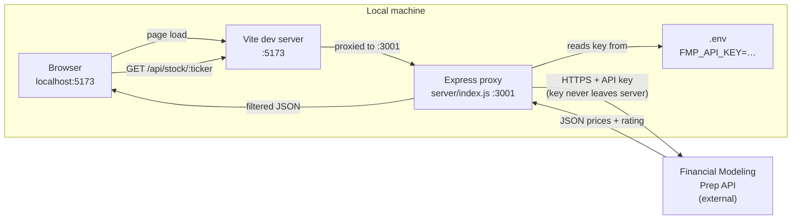
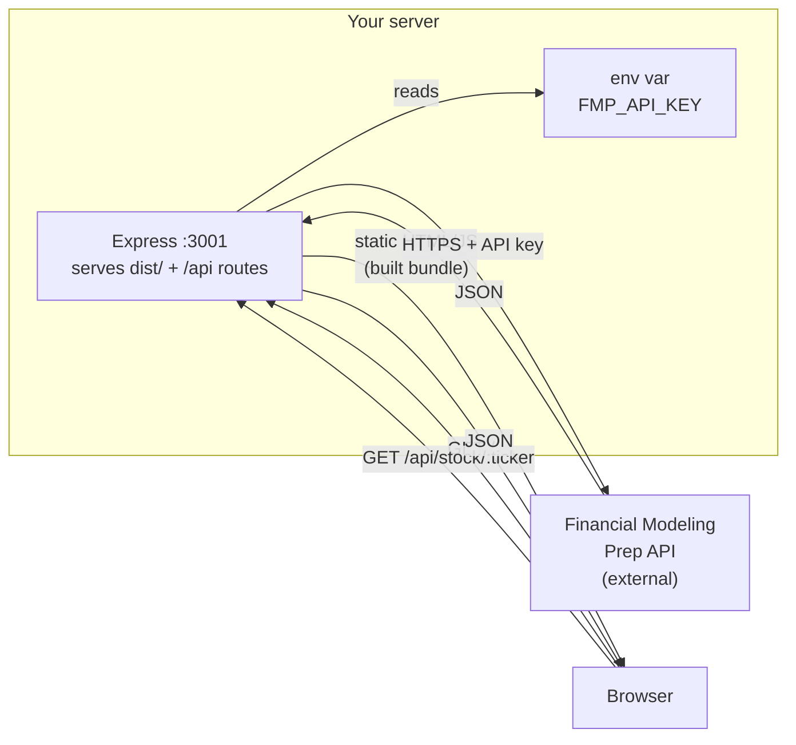

# Stock Back-Tester

A local-first React app that pulls analyst ratings and historical price returns for a watchlist of stocks using the [Financial Modeling Prep](https://financialmodelingprep.com/) (FMP) API.

```
┌──────────────────────────────────────────────────────────────────┐
│  Stock Back-Tester                                               │
│  Analyst ratings & historical returns                            │
├─────────────────────────────────┬────────────────────────────────┤
│  NFLX  [Add]                    │  [Reset]  [Run Backtest]       │
├───┬────────┬──────────┬─────────┬────────┬────────┬─────────────┤
│   │ TICKER │  PRICE   │ RATING  │   3M   │   6M   │     1Y      │
├───┼────────┼──────────┼─────────┼────────┼────────┼─────────────┤
│ ● │  AAPL  │ $213.50  │   Buy   │  +8.2% │ +12.4% │    +18.7%   │
│ ● │  MSFT  │ $421.30  │   Buy   │  +5.1% │  +9.8% │    +24.3%   │
│ ● │  NVDA  │ $875.40  │ St.Buy  │ +18.7% │ +42.1% │    +85.2%   │
│ ● │  TSLA  │ $196.80  │  Hold   │  -3.4% │  -8.9% │     -2.1%   │
│ ● │   JPM  │ $198.20  │   Buy   │  +4.7% │  +8.2% │    +22.1%   │
└───┴────────┴──────────┴─────────┴────────┴────────┴─────────────┘
```

---

## Features

- **3-month, 6-month, and 1-year returns** calculated from daily closing prices
- **Analyst rating** (Strong Buy → Strong Sell) from FMP's DCF/consensus model
- **Current price** displayed for each ticker
- **Add / remove tickers** at runtime — not limited to the default 10
- **Secure API key** — your FMP key lives only in `.env` on the server; it is never bundled into the browser build
- **Single-port production deploy** — Express serves both the API and the built React app

---

## Architecture

### Development mode (`npm run dev`)



The FMP key is read server-side only and **never bundled into the JavaScript** the browser downloads. The browser only ever talks to the Vite dev server on port 5173.

### Production mode (`npm run build && npm start`)



In production a single Express process serves both the pre-built React app (from `dist/`) and the `/api` proxy — one port, no Vite needed.

---

## How the API key is protected

The app uses a small **Express proxy server** that runs alongside the Vite dev server (or serves the production build). All calls to FMP go through this server — the key is read from `.env` server-side and is never included in the JavaScript bundle that reaches the browser. When you push to a server, you set `FMP_API_KEY` as an environment variable there — no secrets in the repository.

---

## Prerequisites

| Requirement | Version |
|-------------|---------|
| Node.js     | **18 or higher** (uses native `fetch`) |
| npm         | 9+ |
| FMP API key | Free tier works for this app |

Get a free FMP key at <https://financialmodelingprep.com/developer/docs>.

---

## Installation

```bash
# 1. Clone the repo
git clone https://github.com/thelightbringer/stocks-back-tester.git
cd stocks-back-tester

# 2. Install all dependencies (frontend + backend in one step)
npm install

# 3. Create your .env file from the template
cp .env.example .env

# 4. Open .env and paste your FMP API key
#    FMP_API_KEY=xxxxxxxxxxxxxxxxxxxxxxxxxxxxxxxx
```

---

## Running locally

```bash
npm run dev
```

This starts two processes with a single command:

| Process | URL | Purpose |
|---------|-----|---------|
| Express proxy | `http://localhost:3001` | Fetches data from FMP; holds the API key |
| Vite dev server | `http://localhost:5173` | Hot-reloading React frontend |

Vite automatically proxies any `/api/*` request to the Express server, so the browser only ever talks to `localhost:5173`.

Open **<http://localhost:5173>**, click **Run Backtest**, and the table will populate ticker by ticker.

---

## Building for production

```bash
npm run build       # outputs static files to dist/
npm start           # Express serves dist/ + the /api routes on port 3001
```

In production both the frontend and the API live on **one port** (`3001` by default, or whatever `PORT` is set to). No separate Vite process needed.

---

## Deploying to a server

1. Copy the project to your server (or `git pull`).
2. Install dependencies: `npm install --omit=dev`
3. Set environment variables on the server (do **not** copy `.env`):
   ```bash
   export FMP_API_KEY=your_key_here
   export PORT=3001
   export NODE_ENV=production
   ```
4. Build the frontend: `npm run build`
5. Start the server: `npm start`

Use a process manager like **PM2** to keep it running:

```bash
npm install -g pm2
pm2 start "npm start" --name stocks-back-tester
pm2 save
```

Put **nginx** (or Caddy) in front to handle HTTPS and proxy traffic to port 3001.

---

## Project structure

```
stocks-back-tester/
├── server/
│   └── index.js        # Express proxy — holds the FMP key, never reaches the browser
├── src/
│   ├── App.jsx         # Main React component
│   ├── main.jsx        # React entry point
│   └── index.css       # Dark-theme styles
├── .env.example        # Template — copy to .env and fill in your key
├── .gitignore          # .env and node_modules are excluded
├── index.html          # Vite HTML entry
├── package.json
└── vite.config.js      # Proxies /api → Express in dev
```

---

## Customising the default watchlist

Edit the `DEFAULT_TICKERS` array at the top of `src/App.jsx`:

```js
const DEFAULT_TICKERS = [
  'AAPL', 'MSFT', 'GOOGL', 'AMZN', 'META',
  'NVDA', 'TSLA', 'JPM', 'V', 'JNJ',
];
```

You can also add or remove tickers at runtime using the input field in the toolbar — changes are reset on page reload.

---

## FMP API endpoints used

| Endpoint | Data |
|----------|------|
| `GET /api/v3/historical-price-full/:ticker?from=...&to=...` | Daily closing prices for the past year |
| `GET /api/v3/rating/:ticker` | Composite analyst rating (Strong Buy / Buy / Neutral / Sell / Strong Sell) |

Both are available on FMP's **free plan** with a rate limit of ~250 requests/day. With 10 tickers, one full backtest run consumes 20 requests.

---

## Return calculation

Returns are calculated from **daily closing prices** stored in the historical dataset:

```
return = (price_today - price_N_days_ago) / price_N_days_ago × 100
```

The closest available trading day to the target date is used (weekends and holidays are skipped automatically).

---

## Troubleshooting

| Symptom | Likely cause |
|---------|-------------|
| `FMP_API_KEY not configured` error | `.env` file is missing or the key is blank |
| `No price data found for XYZ` | Ticker not recognised by FMP (check for typos or delisted symbols) |
| Blank returns but no error | FMP free-tier rate limit hit; wait a minute and retry |
| `ECONNREFUSED` on `/api` | Express proxy is not running — run `npm run dev` (not `npm run dev:client` alone) |

---

## License

MIT
